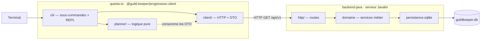

# Architecture — GuildKeeper

> **Ce document fait foi pour tout ce qui touche l'architecture du dépôt.**
> Le *périmètre pédagogique* (ce que les étudiants doivent produire) est défini
> par les instructions remises avec le projet final ; les invariants qui en
> découlent sont rappelés au §10.

---

## Sommaire

1. [Contexte](#1-contexte)
2. [Vue d'ensemble](#2-vue-densemble)
3. [Choix d'architecture](#3-choix-darchitecture)
4. [Backend Java (Javalin)](#4-backend-java-javalin)
5. [Contrat d'API](#5-contrat-dapi)
6. [Module TypeScript](#6-module-typescript)
7. [Stratégie de test](#7-stratégie-de-test)
8. [Développement local](#8-développement-local)
9. [Points différés](#9-points-différés)
10. [Invariants pédagogiques](#10-invariants-pédagogiques)

---

## 1. Contexte

GuildKeeper est le dépôt souche du cours **Tests Unitaires et Logiciels**
(ESGI, B3). C'est un support de cours, mais monté comme un **vrai projet** :
les étudiants ne doivent pas avoir l'impression d'un « exercice jetable ».

L'application se compose de **deux parties** :

- **une seule application avec état**, le serveur Java (Javalin), qui détient
  la base et expose les règles métier sous `/api/v1` ;
- **un module TypeScript** qui la consomme par HTTP en lecture seule, ajoute
  une logique de planification et l'expose via un CLI.

---

## 2. Vue d'ensemble



**Principes :**

- Le **serveur Java est la seule source de vérité** et le **seul processus qui
  ouvre la base**.
- Le **module TS ne mute rien** : il n'appelle que des `GET`. Les écritures
  passent par l'API, exercées par les tests Java et un fichier `.http` du dépôt.
- Les **règles métier vivent en Java**. Le module TS en reproduit certaines
  (simulation de récompense) *volontairement*, et un **test de contrat** garantit
  qu'elles restent synchronisées (voir §5.3).

---

## 3. Choix d'architecture

| # | Choix | Raison | Conséquence |
|---|---|---|---|
| D1 | Le backend Java est un **serveur HTTP (Javalin)** | Un « système de gestion » doit exposer une API ; Javalin reste léger et sans magie | Point d'entrée = bootstrap Javalin sur un port, pas de sous-commande |
| D2 | Le module TS est un **client lecture seule** (client HTTP + planification + CLI) | Lui donne une identité réelle — « le compagnon du maître de guilde » — et une frontière nette avec le serveur | Aucune persistance ni catalogue en dur côté TS ; il ne fait que des `GET` |
| D3 | **DTO écrits à la main** des deux côtés, pas d'OpenAPI | Les étudiants n'ont pas vu OpenAPI ; on veut la frontière client/serveur explicite, sans génération « magique » | Un test de contrat maison remplace la validation de schéma |
| D4 | CLI TS = **sous-commandes** façon `git`/`docker`, **pas** de menu interactif | Un TUI à navigation est pénible à tester — mauvais signal dans un cours de test | Chaque couche du CLI reste testable en isolation |
| D5 | **REPL** disponible mais *stateless* | Donne le feeling « app » à coût quasi nul en réutilisant le parseur | Aucun contexte mémorisé entre deux lignes (pas de `use-member …`) |
| D6 | Parseur d'arguments **maison** | Cohérent avec D3 : pas de magie | ~150 lignes + tests ; périmètre volontairement borné (voir §6.6) |
| D7 | Écritures : **API uniquement** + seed de démo en mode `dev` | Garde visible dans le code la frontière « le client TS n'expose que des lectures » | Les écritures sont documentées dans `docs/api-examples.http` |
| D8 | **Aucune auth** | Hors périmètre du cours | Le transport garde une option `headers` générique, sans concept d'auth |
| D9 | Endpoint **autoritatif de simulation** de récompense + test de contrat | Transforme la duplication de formule (Java ⇄ TS) en frontière testée — leçon utile | `GET /api/v1/quests/{id}/reward-preview` |
| D10 | Steps Cucumber **au niveau domaine** | Rapides, pas de serveur à lancer ; `recruitment.feature` fonctionne ainsi | Cucumber ne teste pas l'app déployée — c'est le rôle des tests `JavalinTest` |
| D11 | Préfixe **`/api/v1`** | Bonne pratique « l'air de rien » | Les DTO et routes vivent sous un espace versionné |
| D12 | Dev local = **deux terminaux documentés**, pas de `docker-compose` | Suffisant pour un monorepo de cours | README : terminal 1 = serveur, terminal 2 = CLI |
| D13 | **Monorepo** | Un seul dépôt de cours à cloner | `backend-java/` et `quests-ts/` côte à côte |

---

## 4. Backend Java (Javalin)

### 4.1 Rôle

Un serveur HTTP unique : il expose l'état de la guilde en lecture, accepte les
mutations métier, détient la base SQLite. Lancé par `java -jar guildkeeper.jar`,
il démarre sur un port et sert l'API.

### 4.2 Structure

```
fr.dev.sensei.guild.keeper
├── http/                    routes Javalin + mapping DTO ⇄ domaine
│   ├── GuildKeeperServer     bootstrap (mainClass)
│   ├── QuestRoutes / MemberRoutes / GuildRoutes
│   └── dto/                  DTO de sortie (records)
├── recruitment/ missions/ rewards/ promotion/ experience/ finance/
│                            domaine : services, entités, ports
├── persistence/sqlite/      repos SQLite = implémentation de production
└── GuildKeeperModule        composition root : câble services + repos
```

Points notables :

- **`GuildKeeperModule`** : un point de câblage unique, pas de
  `new RewardsDistributionService(new ExperienceCalculator(), …)` éparpillé.
- **`http/`** : couche mince. Une route = résoudre les params → appeler un
  service → mapper vers un DTO → sérialiser. Aucune règle métier ici.
- **SLF4J + Logback** pour les logs (diagnostic), séparés de la réponse HTTP.

### 4.3 API `/api/v1`

Voir §5.2 pour la table complète. Contrat de base :

- JSON partout, `Content-Type: application/json`.
- Erreurs : voir §5.4.
- Lecture seule pour le module TS ; les routes d'écriture existent mais ne sont
  appelées que par `curl` / le `.http` / les tests.

### 4.4 Écritures

Endpoints de mutation : `recruit`, `deposit`, `distribute-loot`,
`assign-quest`, `complete-quest`, `promote`. Pas de client TS pour eux.

Données de démo : au démarrage, si `GUILDKEEPER_ENV=dev`, le serveur seed les
5 membres et quelques attributions pour que le CLI TS ait de quoi travailler.
Le catalogue de quêtes (données de référence) est seedé dans **tous** les modes.

---

## 5. Contrat d'API

### 5.1 DTO manuels (D3)

Les DTO sont écrits à la main **des deux côtés** :

- Java : `http/dto/*.java` (records) — forme de la réponse.
- TS : `client/dto/*.ts` (interfaces) — forme attendue.

Ils sont indépendants et **peuvent diverger**. C'est assumé : la divergence est
rattrapée par un **test de contrat** (§7) qui compare les DTO TS à des réponses
réelles enregistrées dans `quests-ts/fixtures/`. Quand le JSON serveur change
sans que le DTO TS suive, le test casse — leçon de cours.

### 5.2 Endpoints

| Méthode | Chemin | Réponse | Consommé par le client TS |
|---|---|---|---|
| `GET` | `/api/v1/quests` | `QuestDto[]` | ✅ |
| `GET` | `/api/v1/quests/{id}` | `QuestDto` | ✅ |
| `GET` | `/api/v1/quests/{id}/reward-preview?luck={n}` | `RewardPreviewDto` | ✅ (test de contrat) |
| `GET` | `/api/v1/members` | `MemberDto[]` (trié par nom) | ✅ |
| `GET` | `/api/v1/members/{name}` | `MemberDto` | ✅ |
| `GET` | `/api/v1/members/{name}/assignments` | `AssignmentDto[]` | ✅ |
| `GET` | `/api/v1/guild` | `GuildStatusDto` | ✅ |
| `POST` | `/api/v1/members` | `MemberDto` | ❌ |
| `POST` | `/api/v1/members/{name}/quests` | `AssignmentDto` | ❌ |
| `POST` | `/api/v1/members/{name}/quests/{id}/completion` | `RewardsResultDto` | ❌ |
| `POST` | `/api/v1/members/{name}/promotion` | `MemberDto` | ❌ |
| `POST` | `/api/v1/guild/deposits` | `GuildStatusDto` | ❌ |
| `POST` | `/api/v1/guild/loot-distributions` | `GuildStatusDto` | ❌ |

### 5.3 `reward-preview` : la valeur autoritative (D9)

`planner/simulate.ts` reproduit les formules XP + butin (chance × valeur de
base). Le serveur expose la **même** valeur, calculée par le domaine Java, via
`reward-preview`. Un test de contrat TS affirme que le miroir est d'accord avec
le serveur sur les fixtures. Si un jour une formule bouge côté Java, le test
rouge signale que le miroir TS doit être remis à jour.

### 5.4 Forme des erreurs

```json
{ "error": "NOT_FOUND", "message": "Aucun membre nommé Gandalf." }
```

`error` est un code stable (`NOT_FOUND`, `VALIDATION`, `CONFLICT`, `INTERNAL`).
Le client TS mappe ce code vers une classe d'exception (§6.3). Le `message` est
lisible, jamais destiné à être parsé.

---

## 6. Module TypeScript

### 6.1 Rôle

`@guild-keeper/progression-client` : une **bibliothèque** (client + logique de
planification) et un **CLI** qui la met en vitrine. « Le compagnon du maître de
guilde » : consulter et planifier, jamais modifier.

### 6.2 Layout

```
src/
  index.ts              entrée lib : ré-exporte client + planner, aucune I/O
  client/
    transport.ts        wrapper fetch : timeout, retry/backoff, headers
    errors.ts           ApiError · NotFoundError · ValidationError · NetworkError
    dto/                QuestDto · MemberDto · AssignmentDto · GuildStatusDto · RewardPreviewDto
    guildKeeperClient.ts  client.quests.list() / .get(id) / .rewardPreview(id, luck)
                          client.members.list() / .get(name) / .assignments(name)
                          client.guild()
  planner/
    unlockTree.ts        quêtes débloquées (isQuestUnlocked, availableQuests)
    recommend.ts         prochaine quête à tenter pour un membre
    simulate.ts          XP + butin estimés — indicatif, le serveur fait foi
    progressionReport.ts rapport de progression d'un membre
  cli/
    parser/
      tokenize.ts        ligne REPL → tokens (guillemets, espaces)
      parse.ts           tokens → { path, positionals, flags } | ParseError   (pur)
      registry.ts        table des commandes { path, run, help }
      dispatch.ts        registry + tokens → exécution
    commands/            un fichier par commande : (ctx, args) => string
    render/              fonctions pures : donnée → texte (table, --json)
    repl.ts              readline en boucle → tokenize → dispatch
    main.ts              SEUL point d'I/O : process.argv, stdout, vrai client
tests/                   miroir de src/
fixtures/                réponses d'API enregistrées (test de contrat)
```

### 6.3 `client/`

- **`transport.ts`** — un `fetch` enveloppé : `timeout` (défaut 5 s), `retry`
  (2 tentatives, backoff 100 ms puis 300 ms) sur erreur réseau / `429` / `502`
  / `503` / `504`, **jamais** sur les autres `4xx`. Option `headers` générique
  (pas d'auth).
- **`errors.ts`** — `NetworkError` (pas de réponse), `NotFoundError` (`404` /
  `error: NOT_FOUND`), `ValidationError` (`400` / `VALIDATION`), `ApiError`
  (tout le reste). Mapping déterministe depuis le code d'erreur.
- **`guildKeeperClient.ts`** — configuré par
  `{ baseUrl, timeoutMs?, headers? }`. `baseUrl` vient de
  `GUILDKEEPER_API_URL` (défaut `http://localhost:7070`), résolu dans `main.ts`,
  **jamais** en dur dans le client.

### 6.4 `planner/`

Fonctions **pures**, nourries par les DTO du client, aucun accès réseau propre.
`recommend` et `progressionReport` reçoivent les données déjà chargées (le CLI
orchestre les appels client, le planner calcule).

### 6.5 `cli/` — commandes

```
guildkeeper quests list                                  [--json]
guildkeeper quests show <id>                              [--json]
guildkeeper members list                                  [--json]
guildkeeper unlock-status <quête> [--completed <quête>]…  [--json]
guildkeeper plan <membre>                                 [--json]
guildkeeper simulate reward <quête> --luck <n>            [--json]
guildkeeper report <membre>                               [--json]
guildkeeper help [<commande>]
guildkeeper                    (sans argument) → REPL
```

Les quêtes se désignent par **titre** (entre guillemets si espaces) ; `show`
accepte l'**id** entier. `--json` sur toute commande de lecture donne une sortie
machine.

### 6.6 Le parseur maison + REPL (D5, D6)

Une seule chaîne, deux entrées :

| Entrée | Chemin |
|---|---|
| `argv` | `process.argv.slice(2)` (déjà tokenisé par le shell) → `parse` → `dispatch` |
| REPL | ligne lue → `tokenize(line)` → `parse` → `dispatch` |

`tokenize` n'est utile qu'au REPL mais reste une unité pure testée à part.
`parse` et `dispatch` sont partagés à 100 %.

**« Robuste » couvre :**
`--flag value` **et** `--flag=value` · `--` terminateur · guillemets au REPL ·
flag inconnu → `ParseError` (pas de crash) · commande inconnue → suggestion
(distance de Levenshtein) · `--help` à chaque niveau.

**« Robuste » ne couvre pas** (volontairement) :
abréviations de commandes · complétion shell · binding env par flag ·
fichier de config.

Le **REPL est stateless** : il ne mémorise aucun contexte entre deux lignes.

---

## 7. Stratégie de test

| Stack | Niveau | Cible | Outils |
|---|---|---|---|
| Java | unitaire | domaine, en isolation | JUnit 5 · Mockito · AssertJ |
| Java | intégration | routes Javalin | `JavalinTest` |
| Java | acceptation | scénarios métier **au niveau domaine** (D10) | Cucumber-JVM |
| TS | unitaire | `parser/`, `planner/`, `render/` — pur | Vitest + fixtures |
| TS | client | `transport` / `guildKeeperClient` avec `fetch` mocké | Vitest + `vi.stubGlobal` |
| **cross-stack** | contrat | DTO TS ⇄ réponses réelles ; `simulate.ts` ⇄ `reward-preview` | Vitest contre le **jar Javalin réel** lancé en CI |

Notes :

- **Cucumber reste au niveau domaine** : les steps instancient les services
  (comme `RecruitmentSteps`), ils n'appellent pas l'API. Tester l'app déployée
  est le rôle des tests `JavalinTest`.
- Le **test de contrat** est le seul qui a besoin des deux stacks ensemble. En
  CI : job qui build le jar, le démarre, puis lance `vitest run` sur les tests
  taggés `contract`.
- Les **tests TODO** qui échouent volontairement (mécanisme pédagogique) portent
  un tag exclu du run par défaut → `mvn test` / `npm test` restent verts.

---

## 8. Développement local

Deux terminaux (D12) :

```bash
# Terminal 1 — le serveur
cd backend-java
GUILDKEEPER_ENV=dev mvn -q compile exec:java     # ou java -jar target/guildkeeper.jar
# → écoute sur http://localhost:7070, seed de démo chargé

# Terminal 2 — le CLI
cd quests-ts
npm run cli -- plan Dragan
npm run cli -- report Dragan
npm run cli                       # REPL
```

`GUILDKEEPER_API_URL` surcharge l'URL cible du CLI si besoin.
`docs/api-examples.http` contient les requêtes d'écriture (REST Client).

---

## 9. Points différés

- **Frontend** : aucun pour l'instant. L'API est dimensionnée pour qu'un
  frontend puisse arriver plus tard sans la retoucher.
- **Auth** : hors périmètre (D8). Le transport a le point d'injection `headers`
  si on veut l'ajouter un jour.
- **Testcontainers** : la couche SQLite reste testée via base éphémère ; on
  pourra montrer Testcontainers en bonus.
- **Pagination** : les collections (`quests`, `assignments`) sont petites et
  renvoyées entières. À revoir si le catalogue grossit.
- **Mode interactif riche** (menu, navigation) : écarté (D4), pas prévu.

---

## 10. Invariants pédagogiques

Ces règles définissent le périmètre étudiant (détaillé dans les instructions
remises avec le projet final) :

- **Règle d'or** : aucun test sur le module `finance`, aucune implémentation de
  la distribution de dividendes. Ce sont les livrables étudiants du projet
  final.
- Les autres modules : code de production complet, tests partiels, le reste en
  **TODO qui échoue** (`fail("Test à compléter")` / `expect.fail(...)`), jamais
  `@Disabled` / `.skip`. Ces tests portent un tag exclu du run par défaut.
- Pattern **AAA**, nommage `should_..._when_...` (Java) / descriptif (TS).
- **Prénoms des membres** — *convention de rédaction, pas une règle métier* :
  dans les exemples et les tests, préférer des prénoms distinctifs (Albéric,
  Attila, Dragan, Dorian, Dante, Ektor…) plutôt que des noms de fantasy
  génériques (Gandalf, Aragorn…). `RecruitmentService.recruit()` accepte
  n'importe quel nom non vide ; seul le doublon est refusé.
